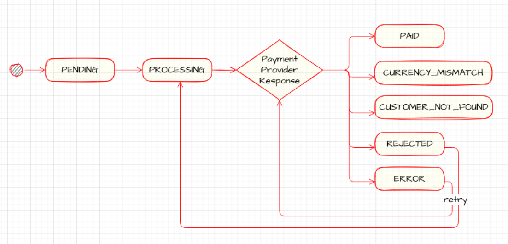
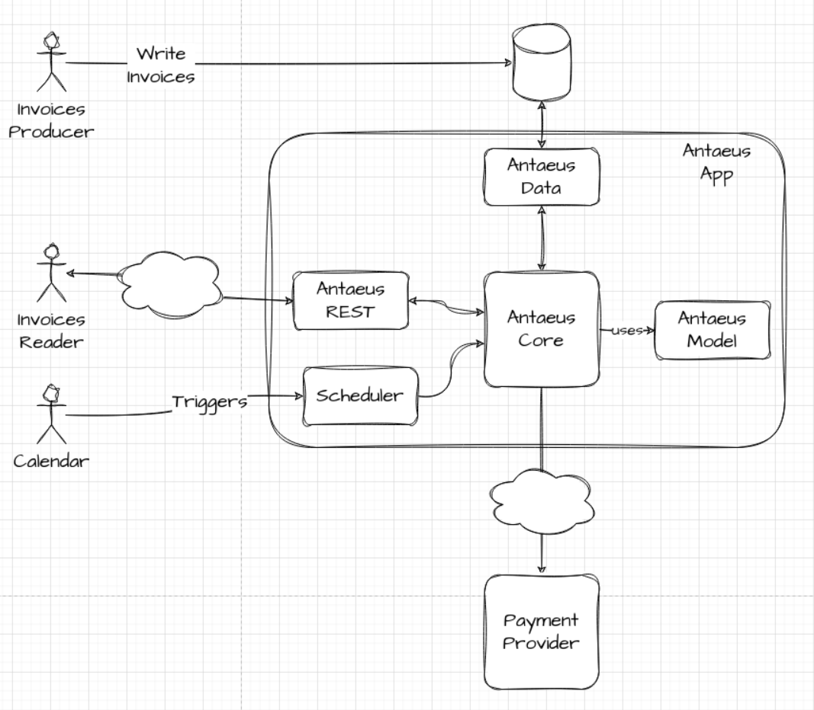
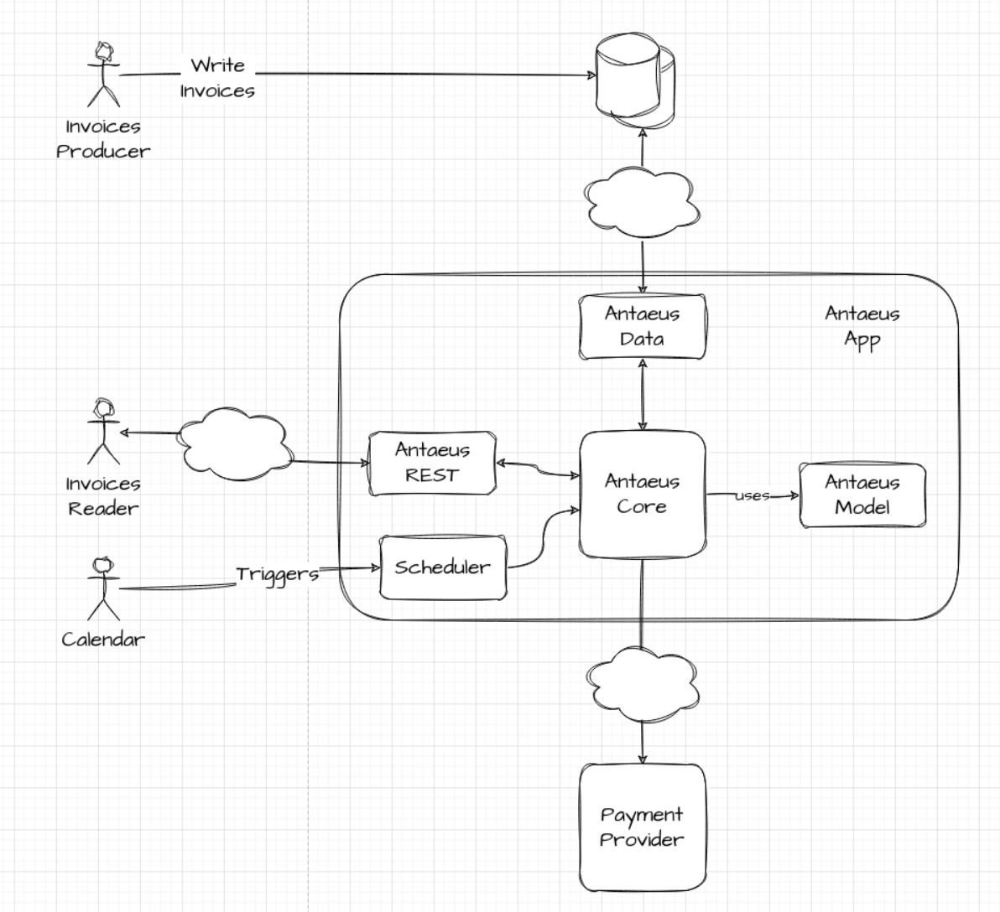
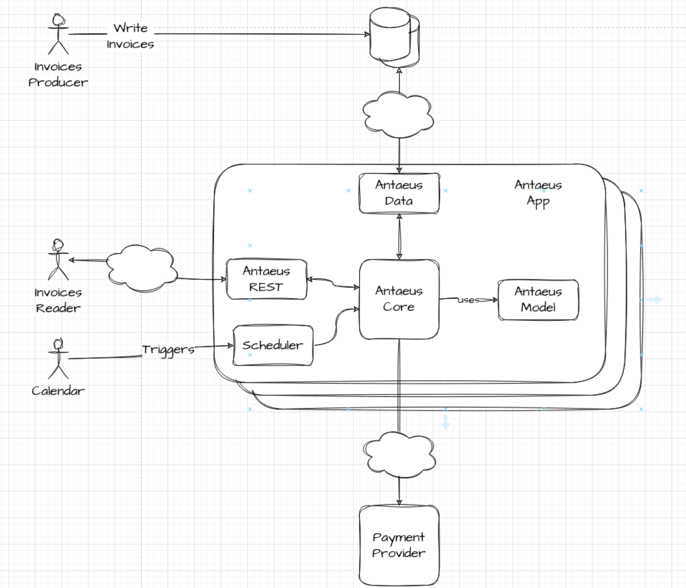
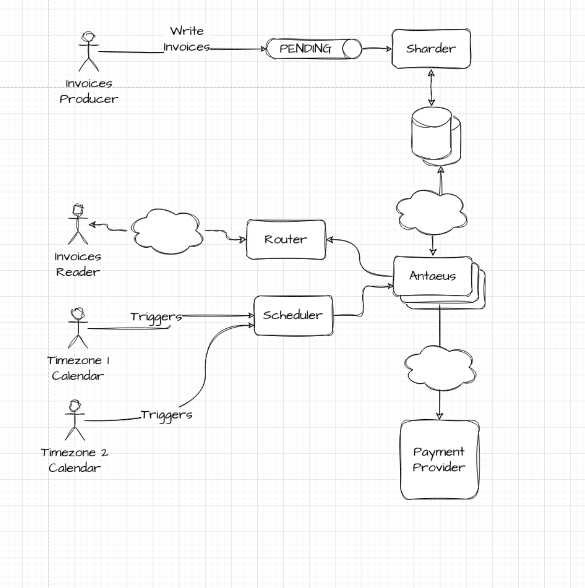
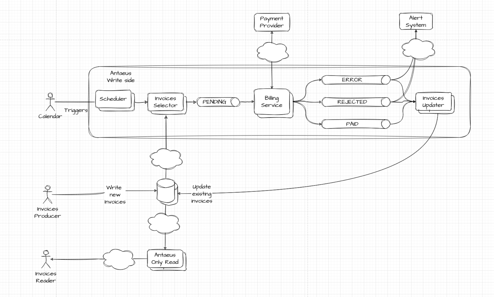

# Antaeus

Antaeus (/ænˈtiːəs/), in Greek mythology, a giant of Libya, the son of the sea god Poseidon and the Earth goddess Gaia. He compelled all strangers who were passing through the country to wrestle with him. Whenever Antaeus touched the Earth (his mother), his strength was renewed, so that even if thrown to the ground, he was invincible. Heracles, in combat with him, discovered the source of his strength and, lifting him up from Earth, crushed him to death.

Welcome to our challenge.

## The challenge

As most "Software as a Service" (SaaS) companies, Pleo needs to charge a subscription fee every month. Our database contains a few invoices for the different markets in which we operate. Your task is to build the logic that will schedule payment of those invoices on the first of the month. While this may seem simple, there is space for some decisions to be taken and you will be expected to justify them.

## Instructions

This repo is just for you, you can make changes as you see fit. Ideally, we'd like to see your progression through commits, and don't forget to update the README.md to explain your thought process.

Please let us know how long the challenge takes you. We're not looking for how speedy or lengthy you are. It's just really to give us a clearer idea of what you've produced in the time you decided to take. Feel free to go as big or as small as you want.

When you're ready, let your talent partner know!

## Developing

Requirements:
- \>= Java 11 environment

Open the project using your favorite text editor. If you are using IntelliJ, you can open the `build.gradle.kts` file and it is gonna setup the project in the IDE for you.

### Building

```
./gradlew build
```

### Running

There are 2 options for running Anteus. You either need libsqlite3 or docker. Docker is easier but requires some docker knowledge. We do recommend docker though.

*Running Natively*

Native java with sqlite (requires libsqlite3):

If you use homebrew on MacOS `brew install sqlite`.

```
./gradlew run
```

*Running through docker*

Install docker for your platform

```
docker build -t antaeus
docker run antaeus
```

### App Structure
The code given is structured as follows. Feel free however to modify the structure to fit your needs.
```
├── buildSrc
|  | gradle build scripts and project wide dependency declarations
|  └ src/main/kotlin/utils.kt 
|      Dependencies
|
├── pleo-antaeus-app
|       main() & initialization
|
├── pleo-antaeus-core
|       This is probably where you will introduce most of your new code.
|       Pay attention to the PaymentProvider and BillingService class.
|
├── pleo-antaeus-data
|       Module interfacing with the database. Contains the database 
|       models, mappings and access layer.
|
├── pleo-antaeus-models
|       Definition of the Internal and API models used throughout the
|       application.
|
└── pleo-antaeus-rest
        Entry point for HTTP REST API. This is where the routes are defined.
```

### Main Libraries and dependencies
* [Exposed](https://github.com/JetBrains/Exposed) - DSL for type-safe SQL
* [Javalin](https://javalin.io/) - Simple web framework (for REST)
* [kotlin-logging](https://github.com/MicroUtils/kotlin-logging) - Simple logging framework for Kotlin
* [JUnit 5](https://junit.org/junit5/) - Testing framework
* [Mockk](https://mockk.io/) - Mocking library
* [Sqlite3](https://sqlite.org/index.html) - Database storage engine

Happy hacking 😁!


## The solution

### Analysis

Provided code is a Kotlin monolithic app using a local DB (SQLite) and organized in several layers (app, core, models, data and rest).
It allows the users to query stored data using REST endpoints.
There is no mention to how new invoices pending to be paid are inserted in the DB, so I'll assume that DB is used as communication mechanism between different systems hence shared. It would be good to know who is creating that data in the DB, when, how often and what data volume we plan to manage.

What we have to do is to adapt the system to be able to send pending invoices from the DB to an external payment provider once a month.
In order to be able to do so we'll start identifying new behaviors/responsibilities/problems.
Later on we can discuss how to sort out all those problems in the best way.

We'll need to think about:
- trigger the payment process once a month.
- fetching pending invoices.
- handle communication with external payment provider.


### Pain points

#### Fetching pending invoices

We can create a new operation in data layer to fetch invoices that are still pending. A simple SELECT ... WHERE query in a new SQL statement could do the work.

What if there are a lot of pending invoices to process? Should we include some kind of pagination? 
Perhaps a new index to speed up this query?
With no information about the data volume is difficult to decide if is worth it to complicate the solution. 
So let's apply the [KISS principle](https://en.wikipedia.org/wiki/KISS_principle) and implement the simplest solution.

#### Scheduling the payment process

Are we sure we want to run the process once a month?
Every first day of the month at 9:00 GMT?
What if the first day of the month is Sunday or a bank holiday?
What about timezones?

Should the scheduling logic be part of Antaeus or should it be an external agent the one that send some kind of signal monthly?
Trying to apply the [single responsibility principle](https://en.wikipedia.org/wiki/Single-responsibility_principle), we can think that scheduling a message is not directly related to invoice payment and that it can change in future when we increase the number of scenarios to cover (for instance, maybe we'll need to send invoices weekly or annually).

Adding to the invoice information about the period it's covering could help to develop a solution more flexible.
We'll work with invoices as they are right now for the challenge.

[Quartz](quartz-scheduler.org) is a well known and battle tested scheduler solution  in the Java world that we can leverage to create our scheduler.

We will need more information to be able to manage different use cases that can appear and, again we'll keep it simple for now.
In order to keep the solution working as a single deployable, we are going to maintain the scheduling logic as a new module in Antaeus that can be easily moved out in future if required.

#### External payment provider

##### Handling the response

External payment provider declares in documentation:

```
  Charge a customer's account the amount from the invoice.

        Returns:
          `True` when the customer account was successfully charged the given amount.
          `False` when the customer account balance did not allow the charge.

        Throws:
          `CustomerNotFoundException`: when no customer has the given id.
          `CurrencyMismatchException`: when the currency does not match the customer account.
          `NetworkException`: when a network error happens.
```

So it looks like we have several scenarios to think about when we send a **PENDING** invoice to the external provider. Let's do it one by one:
- it returns `true`: this is the happy path. 😁
The system should simply update the status in the DB to **PAID**.
- it returns `false`: this means that the payment has been rejected.
What should we do in this scenario? Without more information from the business side I would say that it is reasonable to inform the customer about the situation and try to schedule one retry after some time (3 days?) to give it another try. 
Communication with customers is outside the [bounded context](https://martinfowler.com/bliki/BoundedContext.html) Antaeus is taking care of, so we just need to figure out which is the communication mechanism between Antaeus and this external Customer Service. 
Sending a message to such external system could be a way. 
As an alternative we can also want to keep the use of the shared DB as a communication mechanism between systems in the company and simply change the status of the invoice to **REJECTED** would trigger notification process to the customer. 
Let's keep it simple from now and assume that updating the DB would do the trick.
- it throws `CustomerNotFoundException`: there has been an error in the creation of the invoice. 
As Antaeus is not creating invoices we have to notify an external Invoice system. 
As before we'll just update the status of the invoice to **CUSTOMER_NOT_FOUND**.
- it throws `CurrencyMismatchException`: again this means that there has been an error creating the invoice. 
As there is information about the invoice currency and the customer currency in our DB we can think that we can try to fix the problem but in my opinion this logic does not have to be fixed here but in the creation of the invoice. 
So we are going to notify the Invoice system using the same mechanism as before that is setting the status to **CURRENCY_MISMATCH**.
- it throws `NetworkException`: this happens when there has been some kind of communication problem. 
We should retry after some time because the problem could disappear. 
A nice retry policy should include stopping after certain number of attempts and using something like `exponential backoff`. 
The invoice status will be set to **ERROR** if the problem is not solved after the retries.

##### Resiliency patterns

Every time we design the connection to an external system we should think about resiliency patterns:
- setting timeouts is always a good idea.
- retries could help us to avoid some kind of problems.
- adding a circuit breaker will help to not overload the external system when it is not responding properly.
- perhaps we are only allowed to call an external APIs a number of times per period of time. If that's the case we need to add a rate limiting mechanism.

We are going to continue keeping it simple and we'll set up a retry policy with exponential backoff and a limit of retries.
Maybe we can add the circuit breaker in the second iteration.

##### Invoices lifecycle

As we are using the DB as a communication mechanism with other systems in the company we are going to include new states an invoice could be set at.
Instead of just PENDING and PAID we can model something like:
- PENDING
- PROCESSING
- PAID
- REJECTED
- CUSTOMER_NOT_FOUND
- CURRENCY_MISMATCH
- ERROR




### Testing

We'll try to approach testing with a practical sense, looking for the return of the investment.
With this idea in mind we'll try to fully cover business rules and develop using TDD.
However, we'll reduce the effort put in creating tests that are too brittle and/or hard to maintain tests (i.e. infrastructure code) 
We also appreciate side effects of creating a good test suite while developing like: 
- unit testing as designing approach
- tests as documentation
- safety net for refactors and future changes

### Observability
We'll write **log messages** while the system is running using different levels in order to understand what is happening in every moment.

Monitoring the execution using **metrics** is a must in order to understand how the system behaves in real life. We won't add metrics in the challenge though.

It would be nice to add a **trace id** to each execution in order to be able to understand what happens with each request in different systems.

Existing invoiceId could work but we need to ensure that we are able to query all systems using that id in our observability stack. 

### Security
In a real world application REST interface should be secured in order to allow only authorized users to query the data.
In a similar way, we should control who is able to write invoices in the shared DB. 
However, we'll keep those concerns out of the challenge.

### Performance
As everybody knows, [premature optimization is the root of all evil](https://wiki.c2.com/?PrematureOptimization) so we are approaching the development of the system in a naive way.
If performance becomes a problem we can improve it following these approaches:
- Fetching invoices using pagination: if the number of invoices to process is too big, fetching them from DB could take too long. 
It would be better to create batches of invoices and to do so we can add pagination to our fetching queries. 
Simple pagination could work as a first approach but we can also implement [keyset pagination](https://use-the-index-luke.com/no-offset) if needed. 
- Async programming with ktor: right now we are processing sequentially the invoices we fetch. 
But most of the processing time will be waiting the result to external payment provider. 
In this kind of workload ([IO intensive](https://www.baeldung.com/cs/cpu-io-bound)) we will benefit of using async programming. 
Any of the existing mechanisms to create asynchronous code will help in this regard: 
  - using plain old threads from a thread pool 
  - or brand new [virtual threads](https://wiki.openjdk.org/display/loom/Getting+started) from Loom project
  - or blocking coroutines (because they are not using an asynchronous HTTP client under the hood) 
  - or real [parallel requests](https://ktor.io/docs/request.html#parallel_requests)

Of course there will be costs and drawbacks depending on the selected option. 

### Metadata
Are we happy with no metadata in DB? Having columns like **created_date**, **updated_date** or **updated_by** could help in future troubleshooting scenarios.

## Iterative development

### Iteration #0 Proof of concepts phase

Whenever we want to explore new library, language, paradigm or library it is a good idea to spend some time creating a PoC that will allow the team to get the knowledge they will need in real development.   
The outcome of this phase is the knowledge and the code is discarded. 
 
#### Current tech stack
We'll start exploring the provided project and creating a little change in several layers in order to get familiarized with Javalin and Exposed.  

#### Quartz in Kotlin
We can create a simple scheduler using Quartz java library from Kotlin.

### Iteration #1 Minimum Viable Product

We'll develop a solution to the problem using the provided architecture and taking care of all the business needs we identified so far.
This solution work just fine but there are some inconveniences with it:
- There is no redundancy or high availability. It is a single deployable working with a local DB so if it crashes, the service will be stopped.
- The number of invoices it can handle depends on the power of a single machine

REST read only endpoints:
- GET $HOSTNAME/rest/v1/invoices
- GET $HOSTNAME/rest/v1/invoices/$ID
- GET $HOSTNAME/rest/v1/invoices\?byStatus=$STATUS
- GET $HOSTNAME/rest/v1/customers
- GET $HOSTNAME/rest/v1/customers/$ID

There are 2 scheduler jobs triggered each 30 secs (for testing purposes) to look for pending and rejected invoices respectively. 



### Iteration #3 Extracting the DB

In order to be able to scale up the system, it would be a good idea move out the local DB to an external cluster. 
This way the system will get redundancy in the data layer and a centralized point to create backups and apply updates.



### Iteration #4 Multiples instances running at the same time

If we need to process more requests than the number a single machine can handle, we can do it by running several instances of Antaeus at the same time.
There is one caveat, we are now entering the distributed systems world and we have to take into account *concurrency* problems. 
Concurrency problems are linked to shared mutable data and in our case we need to ensure that 2 instances of Antaeus don't process the same invoice.

We can achieve that using the transactionality mechanism present in relational DBs:
- we will create a new state **PROCESSING** to the invoice lifecycle.
- every time we fetch **PENDING** invoices to be processed, we have to set the new state **PROCESSING** to all those invoices IN THEN SAME TRANSACTION.



### Iteration #5 Sharding

If the amount of invoices keep growing we can face a different kind of problems: DB operations will take longer and reduce performance.
We could think on developing an **archiving** mechanism to store old invoices in a different data store. 
This will help in fetching pending invoices operation but it will add complexity in the REST layer if we want to be able to query those old invoices.
[DB sharding](https://en.wikipedia.org/wiki/Shard_(database_architecture)) could be a more suitable approach in this scenario as it seems that we can split the dataset in a natural way by customers.

We have to add 2 new components:
- Sharder: that will split the dataset with a defined criteria (for example: customers in the same timezone and with id in ranges of 10k) redirecting incoming invoices to the correct DB.
- Router: a fast reverse proxy will redirect the requests to the proper Antaeus instance



### Iteration #6 Microservices

In order to be able to scale independently each component of the system we can split up the Antaeus monolith and create a microservices architecture.
As we have identified responsibilities from the beginning of the development, we can use that logic division to create services that can be scaled accordingly with the system needs.
We'll stick to [CQRS](https://en.wikipedia.org/wiki/Command%E2%80%93query_separation#Command_Query_Responsibility_Segregation) and use serialized [business events](https://en.wikipedia.org/wiki/Event-driven_architecture) as communication mechanism putting queues as buffers between each component. 



## Work journal

I've spent around 16 hours working on the challenge:
- A couple of hours working in initial analysis and PoCs.
- Around 6 hours designing and developing MVC.
- A little bit more than 4 hours documenting and detailing the evolution of the architecture from MVP to microservices.
- Less than 4 hours polishing code, docs and adding a couple of improvements over the MVP.

## Conclusion

It has been fun doing the challenge!! 😁

Having the DB as communication mechanism was a weird idea for me at first and that forced me to think outside my comfort zone which is always enriching.

There are lots of ideas that I had to leave out due to time limitations (I would have loved to play a bit with Ktor) but we always have to ship at some point. 

Cheers!


